# Microsoft Entra ID (Azure AD) — Identity & Access Management Lab
---
 
## Objective
 
This project simulates the administration of a cloud-based identity and access management environment using Microsoft Entra ID. Using a free Azure tenant, I provisioned and managed user identities, organized them into security groups, and enforced Role-Based Access Control (RBAC) following the principle of least privilege. I configured tenant-wide Multi-Factor Authentication (MFA) via Security Defaults, documented the SSPR configuration process, and reviewed audit and sign-in logs for access monitoring and transparency.
 
This environment is themed around the Destiny universe: A game that has meant a great deal to me personally. Creating the project this way really makes it more engaging and memorable, while still demonstrating the same real-world IAM skills used in enterprise IT environments.
 
**Skills demonstrated:** Microsoft Entra ID · User Provisioning · RBAC · Security Groups · MFA · SSPR · Audit Logging · Least Privilege · Identity Lifecycle Management
 
---
 
## Why Destiny?
 
The Destiny franchise is special to me. I have never been so invested in a game in my entire life. It started in fifth grade and I never really let go. The music, the scenery, the lore, the world-building — everything about it captivated me in a way nothing else has. It felt like more than a game; it felt like a place I could escape to whenever I felt like it and just vibe.
 
Fast-forwarding to 2026, the franchise has met an uncertain conclusion, but there is no denying the impact it has had on my life. It will forever hold a place in who I am. Bringing Destiny into a cybersecurity project was spontaneous and felt like the right way to honor the game.
 
---
 
## Phase 1 — Tenant Setup & Orientation
 
The first step was navigating to Microsoft Entra ID inside the Azure Portal and confirming the default tenant was active and ready. The overview page shows the tenant name, ID, primary domain, license tier, and a baseline count of users, groups, applications, and devices — essentially the naked state of the environment before any configuration.
 
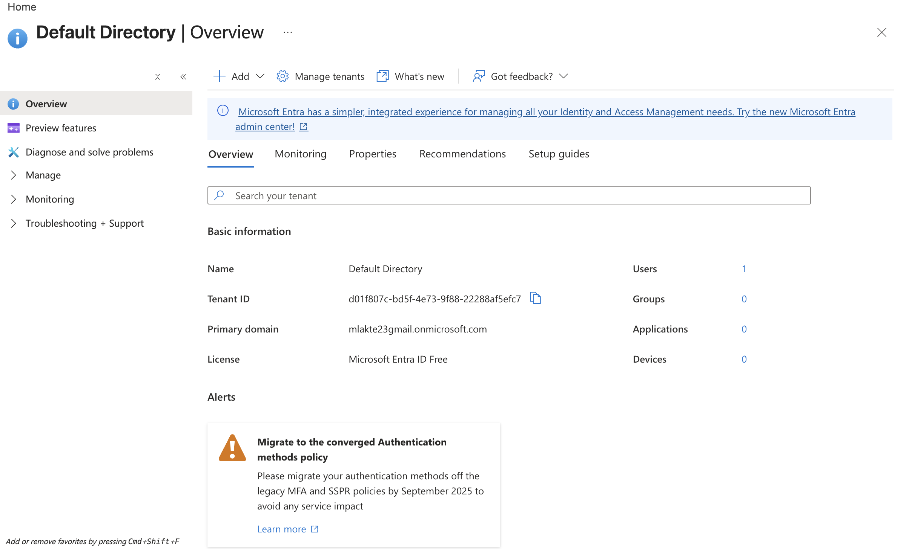
 
---
 
## Phase 2 — User Provisioning
 
I could have created generic placeholder employees, but I wanted to have some fun with this. The users in this lab are based on characters from Destiny 1 and Destiny 2 — each one placed into a department and job title that fits their role in the game's lore.
 

 
Each user was created with a User Principal Name (UPN), display name, job title, department, and a temporary password. 
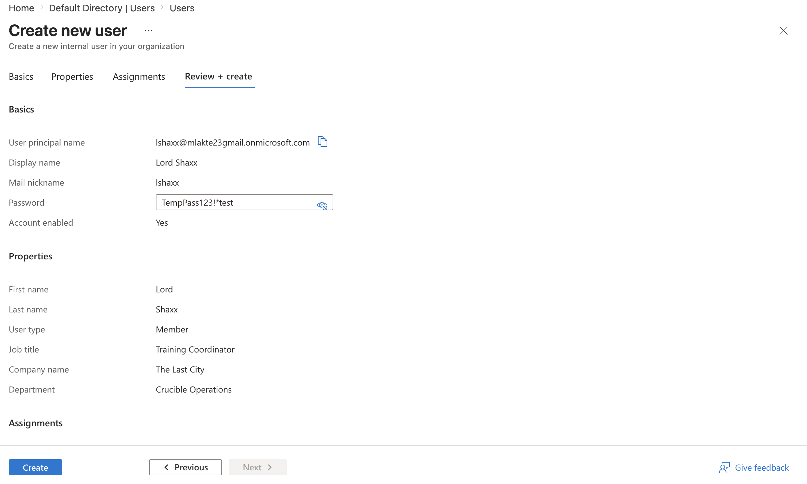
 
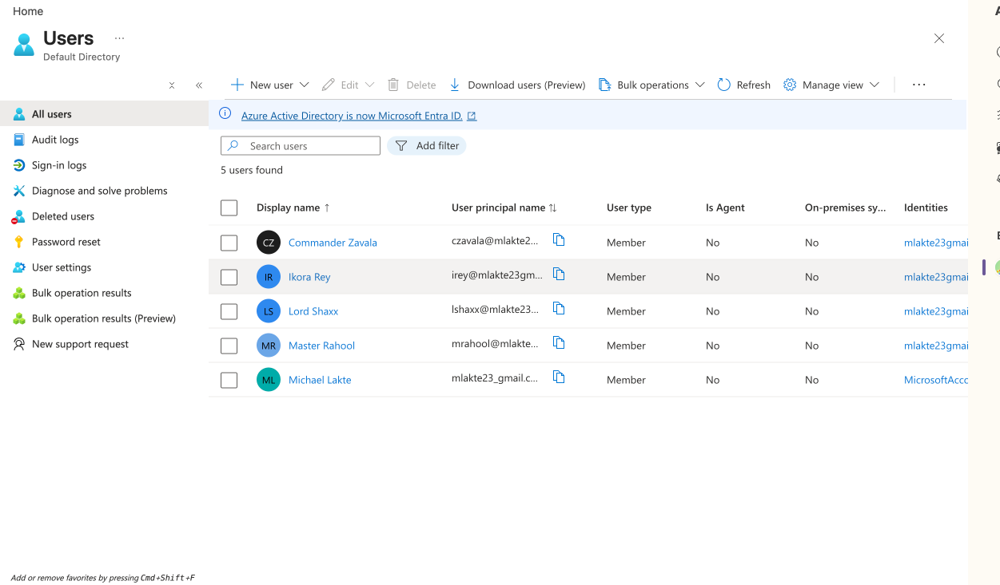
 
---
 
## Phase 3 — Security Groups
 
With users created, I organized each Guardian into their respective faction group. Using security groups instead of assigning permissions directly to individual users is a core IAM best practice. This makes access management scalable and consistent.
 

 
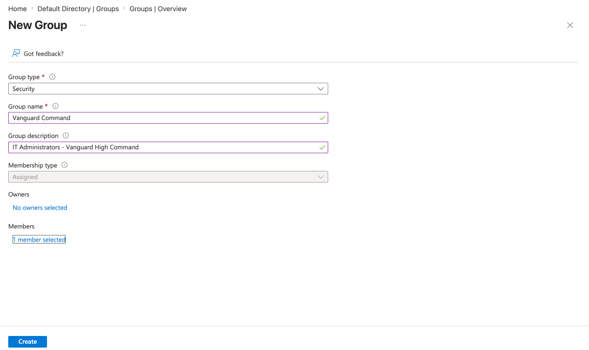
 
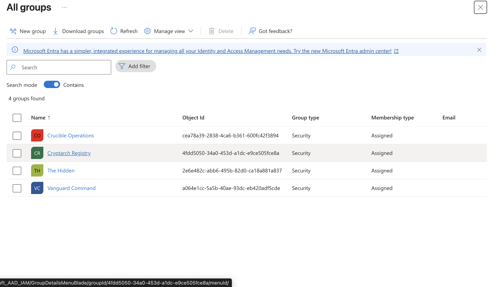
 
---
 
## Phase 4 — Role-Based Access Control (RBAC)
 
This phase is where the principle of least privilege comes into practice. Each Guardian was assigned only the role their responsibilities require and nothing more. Im actually baffled of the amount of roles Entra ID has listed with all their different functions.
 
 
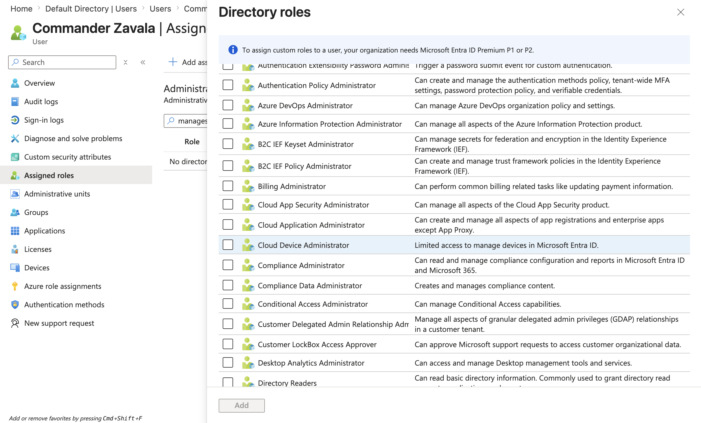
 
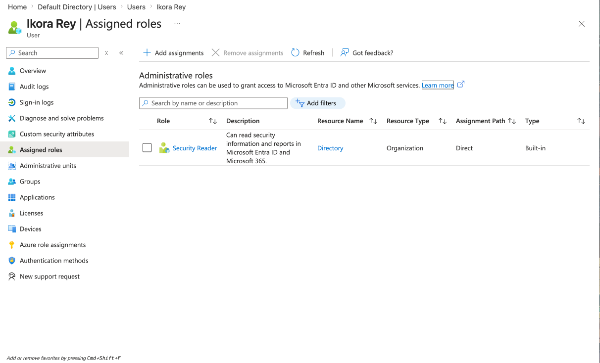
 
---
 
## Phase 5 — Multi-Factor Authentication (MFA)
 
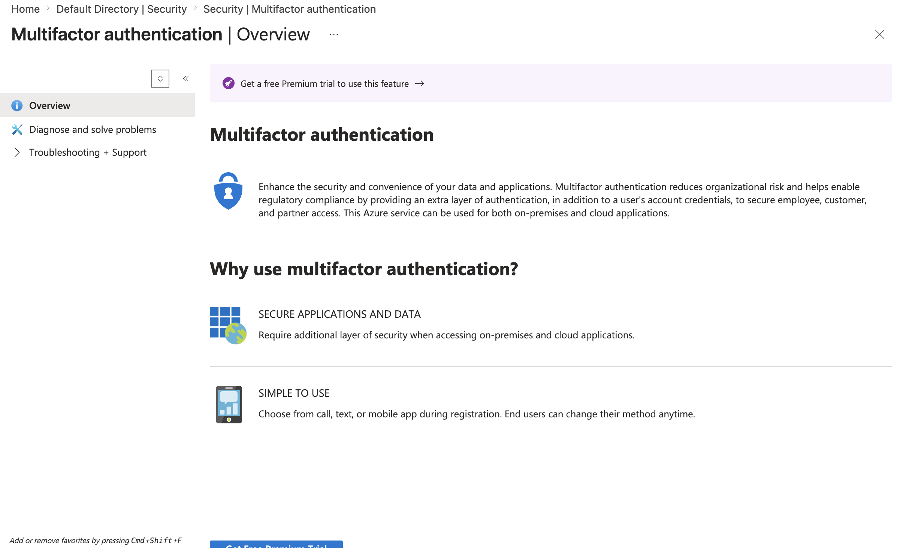
 
Enabling per-user MFA requires Microsoft Entra ID Premium , which is beyond the free tier. Hitting this wall was a useful reminder of where the free tier ends and where enterprise licensing begins. As an alternative, I searched for another security option and found a security defaults tab. I made sure that security defaults were enabled.
 
This is the configuration Microsoft recommends for organizations that do not yet have a premium license, and it is probably what many small and mid-size businesses run in production.
 
Note: The Security Defaults panel states that MFA protects against 99.9% of account compromise attempts, while Security Defaults alone reduces compromise rates by 80%. That gap is the business case for upgrading to Premium and implementing Conditional Access policies in a real environment.
 
 
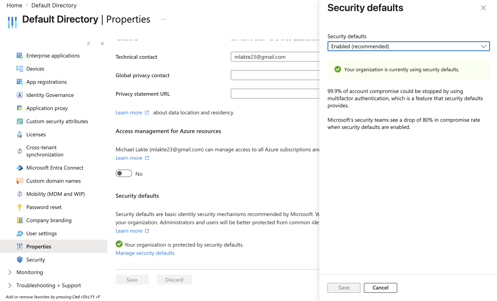
 
---
 
## Phase 6 — Self-Service Password Reset (SSPR)
 
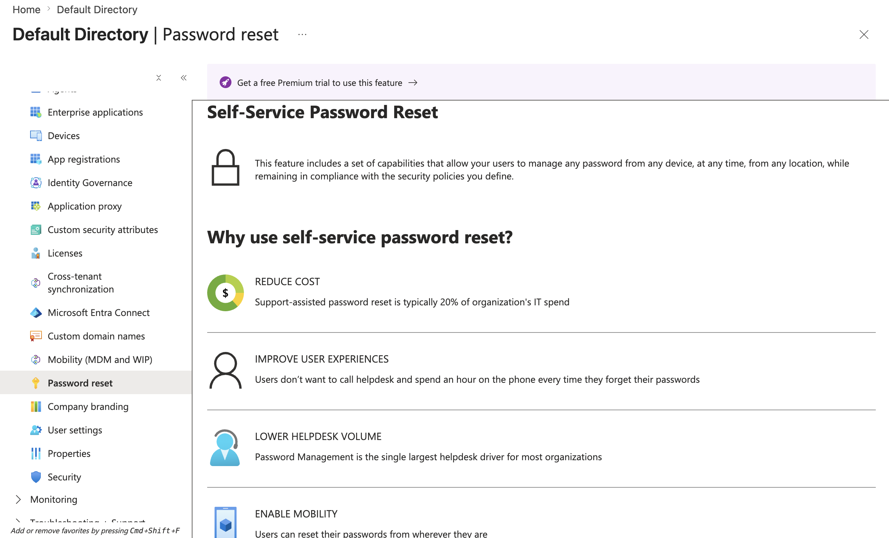
 
SSPR configuration also requires Microsoft Entra ID Premium — a second encounter with the licensing wall,  I got a bit frustrated
 
SSPR allows end users to reset their own passwords without contacting IT, reducing ticket volume on one of the most common request types. 

In a Premium environment, the configuration would involve:
- Scoping SSPR to a pilot group first (e.g., Vanguard Command) before org-wide rollout
- Setting the number of required authentication methods to 1 or 2
- Enabling authentication methods such as email, mobile phone, and authenticator app
- Reviewing the SSPR activity report to monitor usage and failed attempts
This phased rollout approach — pilot group first, then expand
 
---
 
## Phase 7 — Audit Logs & Sign-In Monitoring
 
With the environment fully configured, I reviewed the audit and sign-in logs to see everything that had been recorded throughout the project.
 
**Audit Logs** captured every administrative action taken during the build — user creation, group assignments, role changes, policy updates, and Security Defaults configuration — all with precise timestamps. Clicking into any entry reveals a full detailed description including the initiating user, the target object, what changed, and the IP address and device used. This level of transparency is what makes Entra ID audit logging so valuable in a real environment: you always know what changed, who changed it, and when.
 
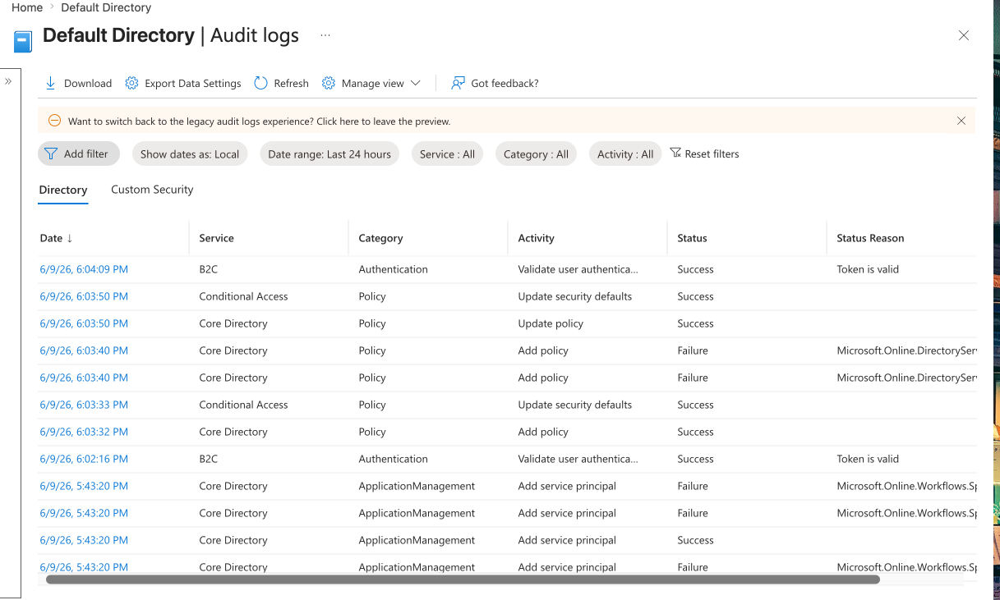
 
**Sign-In Logs** showed every authentication event against the tenant, including the user principal name, application accessed, IP address, and geographic location.
 
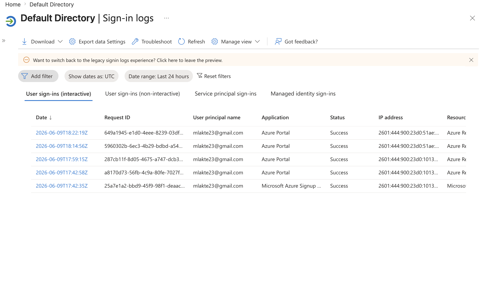
 
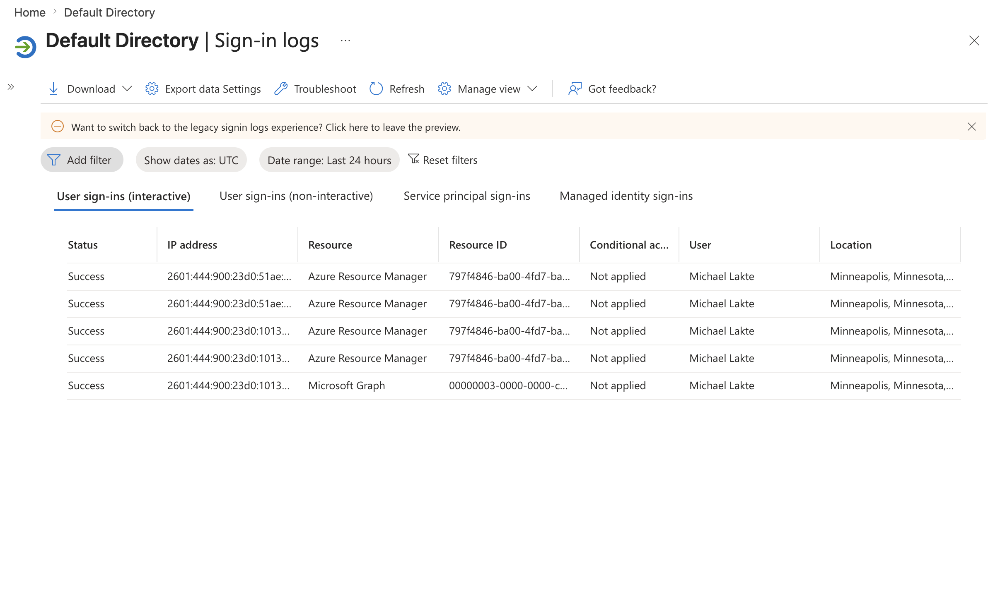
 
---
 
## Conclusion
I actually had a lot of fun with this.
 
This project gave me hands-on experience with the core workflows of cloud identity administration inside Microsoft Entra ID. Provisioning users, organizing them into security groups, assigning scoped roles, enforcing MFA at the tenant level, and reviewing audit and sign-in logs are all tasks that map directly to  help desk and IAM responsibilities.
 
Running into the Premium license wall for SSPR and MFA was actually valuable in its own way because it forced me to understand why those features are gated, what the free-tier alternatives look like, and how to notice the difference between Security Defaults and a full Conditional Access policy. 

 
 
---
 
## Tools & Technologies
 
Microsoft Azure · Microsoft Entra ID (Free Tier),  Azure Portal, RBAC,  Security Defaults, Audit Logging, Sign-In Monitoring
 
---
 
*Project completed: June 2026*  
 
